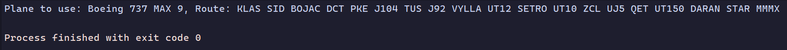

# Project JavaScript Syntax: Mixed Messages

This project is part of the Career Path of Full-Stack Engineer made by Codecademy,


## The project's objectives are:

- Build a message generator program using JavaScript
- Use Git version control
- Use command line
- Develop locally on your computer


## About the project

I am using this project to create a flight plan generator program, which does not use real-time data and is limited to the data I wrote.


##  How does it function?

This program's basic function is to accept the data of aircraft, airports, and routes and convert it into a message that changes every time it is called.

The message is formatted as follows:

```sh
Plane to use: ${Random Plane}, Route: ${Departure Airport (ICAO)}, ${Route (Airways, Fixes, VOR’s)}, ${Arrival Airport (ICAO)}. 
```

This is how it seems, printed to the console: 
